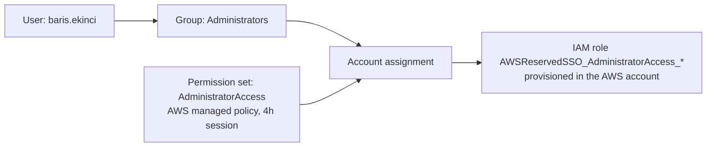

# AWS IAM Identity Center with Terraform

Replacing a long-lived admin access key with short-lived, MFA-protected access, fully managed as code.

## The problem

My AWS account was administered through an IAM user with a long-lived access key, eight months old. If that key leaked, it would grant full admin access until someone noticed and revoked it.

## What I built

- **AWS Organizations + IAM Identity Center** (single-Region instance in eu-central-1)
- **Group-based access in Terraform:** user, group, membership, permission set, policy attachment and account assignment
- **Console sign-in with MFA**, and **CLI access through `aws configure sso`** using temporary credentials with a 4-hour session limit
- **Safe cutover:** the old access key was deactivated only after the new path was proven end to end



## Design decisions

| Decision | Why |
|---|---|
| Single-Region instead of the console's Multi-Region default | Avoids a customer managed KMS key (cost, key-policy risk). Multi-Region resilience isn't justified for a one-person account. |
| No hardcoded IDs | Instance ARN, identity store ID and account ID are read live through data sources, so the code is reusable and can't go stale. |
| Permissions granted to groups, not users | Joining or leaving changes membership, not permissions. |
| Separate Terraform project and state from my website infrastructure | Limits the blast radius of a mistake in either project. |
| Deactivate the old key before deleting it | Fully reversible if something still depended on it. Last-used data was checked first. |

## How it was verified

- Every resource was cross-checked between Terraform state and the AWS APIs (`identitystore`, `sso-admin`, `iam`).
- The IAM role list was empty after creating the permission set, and showed the `AWSReservedSSO_*` role only after the account assignment, which confirmed when provisioning happens.
- `aws sts get-caller-identity` returns an `assumed-role` ARN with the `AROA` prefix instead of the IAM user.
- Both Terraform projects show "No changes" when run through SSO.
- Calls with the old key fail with `InvalidClientTokenId`.

## Known limitations and next steps

- Admin access is assigned in the management account. Fine for a single-account lab; in a real organization this would target member accounts.
- The Organization and the Identity Center instance were created outside Terraform (the instance has no API for enabling it).
- State is local and git-ignored. A remote backend is a planned later exercise.
- Next: delete the deactivated key after a burn-in period, and add a least-privilege `ReadOnly` permission set.

## Tech

Terraform (AWS provider 6.x) · AWS IAM Identity Center · AWS Organizations · AWS CLI v2 · Git / GitHub

## Running it

Requires an AWS Organization with an Identity Center organization instance already enabled.

```
terraform init
terraform plan -out=tfplan
terraform apply tfplan
```
